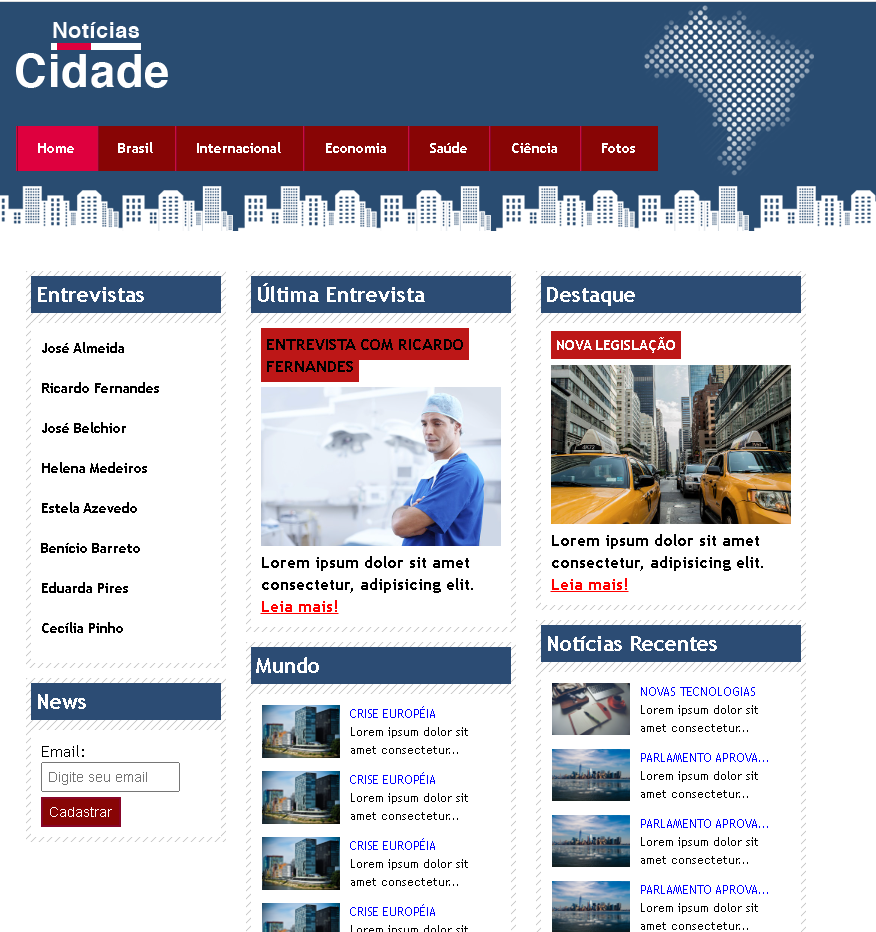

<h1 align="center"> Notícias Cidade </h1>

Modelo de site utilizando algumas ferramentas básicas do HTML e CSS como: "hover", "float" e "form e submit"   

  <a href="#rocket-tecnologia">Tecnologias</a>&nbsp;&nbsp;&nbsp;|&nbsp;&nbsp;&nbsp;
  <a href="#computer-projeto---acesse-aqui">Projeto</a>&nbsp;&nbsp;&nbsp;|&nbsp;&nbsp;&nbsp;
  <a href="#memo-licença">Licença</a>

  

 

  

## :rocket: Tecnologia

Esse projeto foi desenvolvido com as seguintes tecnologias:

- HTML
- CSS

## :computer: Projeto - [Acesse aqui](https://allanpt.github.io/Noticias_cidade)

Esse projeto tem por conceito aplicar os conhecimentos estudados pela plataforma de ensino Udemy Academy.

## :memo: Licença

Esse projeto está sob a licença MIT.